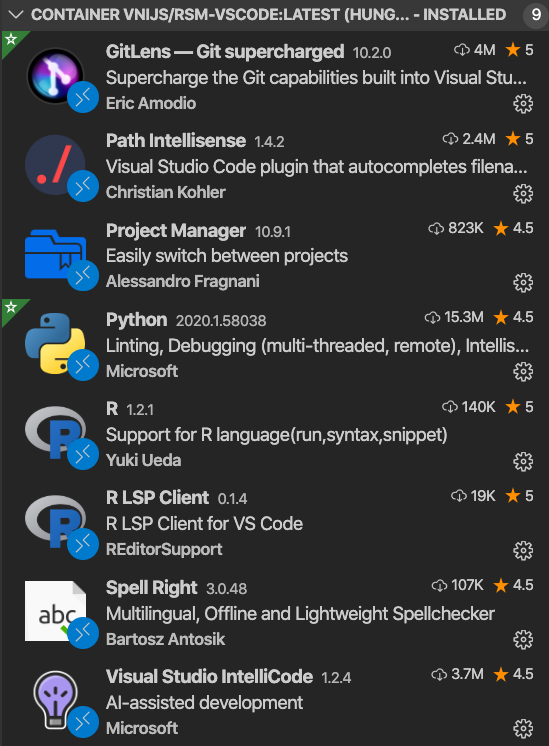

Dockerized Business Analytics
==================================

This repo contains information to setup a docker image with R, Rstudio, Shiny, [Radiant](https://radiant-rstats/radiant), Python, Postgres, JupyterLab, and Code-Server (aka VS Code)

## Install Docker

To use the docker images you first need to install Docker

* For Mac: https://docs.docker.com/docker-for-mac/
* For Windows: https://docs.docker.com/docker-for-windows/
* For Linux: https://docs.docker.com/engine/installation/

After installing Docker, check that it is running by typing `docker --version` in a terminal. This should return something like the below:

```bash
docker --version
Docker version 18.09.2, build 6247962
```

On windows please install Git Bash:

http://www.techoism.com/how-to-install-git-bash-on-windows/

For detailed install instructions on Windows see [install/rsm-msba-windows.md](install/rsm-msba-windows.md)

For detailed install instructions on macOS see [install/rsm-msba-macos.md](install/rsm-msba-macos.md)

## r-bionic

You probably don't want to _run_ this image by itself. It is used in the `radiant`, `rsm-msba-spark`, and `rsm-jupyterhub`, application (see below). To build a new container based on `r-bionic` add the following at the top of your Dockerfile

```
FROM vnijs:docker-bionic
```

To build r-bionic yourself use:

```sh
docker build -t $USER/r-bionic ./r-bionic
```

To push to docker hub use:

```bash
sudo docker login 
docker push $USER/r-bionic
```

## radiant

The second image builds on `r-bionic` and adds [radiant](https://github.com/radiant-rstats/radiant) and required R-packages. To build a new container based on `radiant` add the following at the top of your Dockerfile

```
FROM vnijs:radiant
```

To allow execution of R-code in _Report > Rmd_ and _Report > R_ in Radiant add the following to .Rprofile in your home directory

```r
options(radiant.ace_vim.keys = FALSE)
options(radiant.maxRequestSize = -1)
# options(radiant.maxRequestSize = 10 * 1024^2)
options(radiant.report = TRUE)
# options(radiant.shinyFiles = TRUE)
# options(radiant.ace_theme = "cobalt")
options(radiant.ace_theme = "tomorrow")
# options(radiant.ace_showInvisibles = TRUE)
```

## rsm-msba-spark

The third image builds on the radiant image and adds python, jupyter lab, and spark. To build a new container based on `rsm-msba-spark` add the following at the top of your Dockerfile

```
FROM vnijs:rsm-msba-spark
```

## rsm-jupyterlab

This image builds on rsm-msba-spark and is set up to be accessible from a server running jupyter hub.

## rsm-vscode

This image contains all R and Python libraries found in `rsm-msba-spark` and `rsm-jupterlab` but does not include Jupyter Lab, Shiny server, Rstudio server, or VS Code (codeserver). It is intended to be used with a local install of [VS Code](https://code.visualstudio.com/download). Once you start the container using `launch-rsm-vscode` you can use "Remote-Containers: Attach to Running Container" from VS Code to connect. Recommended extensions to use with the container are shown in the screenshot below:



## Trouble shooting

To stop (all) running containers use:

```bash
docker kill $(docker ps -q)
```

If the build fails for some reason you can access the container through the bash shell using to investigate what went wrong:

```sh
docker run -t -i $USER/rsm-msba-spark /bin/bash
```

To remove an existing image use:

```sh
docker rmi --force $USER/rsm-msba-spark
```

To remove stop all running containers, remove unused images, and errand docker processes use the `dclean.sh` script

```sh
./dclean.sh
```

## General docker related commands

Check the disk space used by docker images

```bash
docker ps -s
```

```bash
docker system df
```

## Trademarks

Shiny and Shiny Server are registered trademarks of RStudio, Inc. The use of the trademarked terms Shiny and Shiny Server and the distribution of the Shiny Server through the images hosted on hub.docker.com has been granted by explicit permission of RStudio. Please review RStudio's trademark use policy and address inquiries about further distribution or other questions to permissions@rstudio.com.

Jupyter is distributed under the BSD 3-Clause license (Copyright (c) 2017, Project Jupyter Contributors)

## Acknowledgements

Thanks to Ajar Vashisth for helping me get started with Docker and Docker Compose
